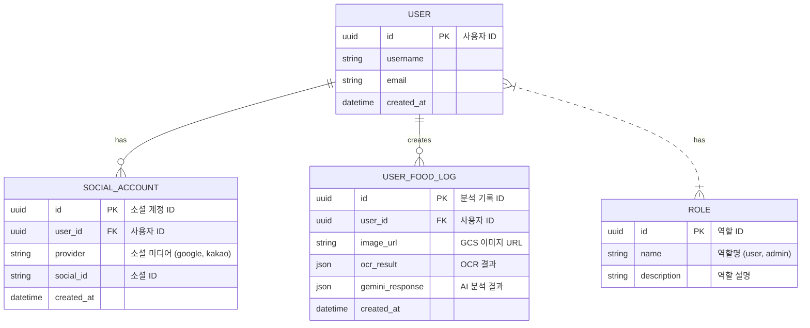

# 🤰 먹어도 돼? - 임산부를 위한 AI 성분 분석 가이드

**"이거, 임신 중에 먹어도 괜찮을까?"**  
세상 모든 예비 엄마들의 작은 걱정을 덜어주기 위해 시작된 AI 기반 웹 서비스입니다. 음식 성분표 이미지를 업로드하면, AI가 임신부에게 잠재적으로 유해할 수 있는 성분을 분석하고 신뢰할 수 있는 섭취 가이드를 제공합니다.

[](https://cloud.google.com/run)
[](https://fastapi.tiangolo.com/)
[](https://streamlit.io/)
[](https://ai.google/discover/gemini/)

---

## 🎥 프로젝트 데모

*(프로젝트의 실제 작동 모습을 보여주는 GIF나 짧은 영상을 여기에 추가하세요.)*


| 로그인 | 이미지 업로드 | AI 분석 결과 |
| :---: | :---: | :---: |
| *(스크린샷 1)* | *(스크린샷 2)* | *(스크린샷 3)* |

---

## 🏛️ 시스템 아키텍처

MSA(Microservice Architecture) 사상을 적용하여 **Streamlit 프론트엔드**와 **FastAPI 백엔드**를 분리 설계했습니다. 이를 통해 각 서비스의 독립적인 개발 및 배포가 가능해졌고, 유지보수성을 향상시켰습니다. 모든 서비스는 Docker 컨테이너화되어 GCP Cloud Run을 통해 서버리스 환경에서 효율적으로 운영됩니다.

> 💡 **Note:** 아래 Mermaid 코드를 [Mermaid Live Editor](https://mermaid.live/) 등에 붙여넣으면 다이어그램 이미지를 생성할 수 있습니다.

```mermaid
graph TD
    subgraph User
        A[웹 브라우저]
    end

    subgraph GCP Cloud Run (Frontend)
        B[Streamlit Web App]
    end

    subgraph GCP Cloud Run (Backend)
        C[Nginx] --> D{Supervisor}
        D --> E[FastAPI: Uvicorn]
        D --> F[Cloud SQL Proxy]
    end

    subgraph Google Cloud Platform
        G[Cloud SQL for PostgreSQL]
        H[Cloud Storage]
        I[Cloud Vision AI]
        J[Google Gemini Pro]
        K[Secret Manager]
    end

    subgraph External Services
        L[Google OAuth 2.0]
        M[Kakao OAuth 2.0]
    end

    A -- HTTPS --> B
    B -- REST API (JWT Auth) --> C
    E -- DB Connection via Proxy --> G
    E -- Image CRUD --> H
    E -- OCR Request --> I
    E -- AI Analysis Request --> J
    E -- Load Secrets --> K
    E -- Social Login --> L
    E -- Social Login --> M
```

---

## 📄 데이터베이스 ERD

사용자, 소셜 계정, 분석 기록을 중심으로 데이터 모델을 설계했으며, `SQLModel`을 사용하여 Python 클래스와 DB 스키마를 일관성 있게 관리합니다.



---

## ✨ 핵심 기능 및 구현 과정

### AI 답변 신뢰성 강화를 위한 RAG 아키텍처 구축

LLM의 가장 큰 약점인 **환각(Hallucination) 현상**을 최소화하고, 사실에 기반한 신뢰도 높은 답변을 제공하기 위해 **RAG(Retrieval-Augmented Generation)** 파이프라인을 직접 설계하고 구현했습니다.

#### RAG 파이프라인 흐름도

```mermaid
graph LR
    subgraph Data Preprocessing (Offline)
        A[PDF Documents] --> B{PyMuPDFLoader};
        B --> C[RecursiveCharacterTextSplitter];
        C --> D[GoogleGenerativeAIEmbeddings];
        D --> E[FAISS Vector Store];
        E -- Save Index --> F[(faiss_index_thesis)];
    end

    subgraph Query Processing (Online)
        G[User Query] --> H[GoogleGenerativeAIEmbeddings];
        H -- Embed Query --> I((FAISS Index));
        I -- Similarity Search --> J[Relevant Documents];
        G & J -- Combine --> K{Prompt Template};
        K --> L[Google Gemini Pro];
        L --> M[Final Answer];
    end
```

#### 구현 상세 (`services/rag.py`)

1.  **데이터 소스:** 임산부 영양 및 식품 안전 관련 논문, 의학 가이드라인 PDF 파일을 신뢰할 수 있는 원천 데이터로 사용했습니다.
2.  **문서 처리:** `PyMuPDFLoader`로 PDF 텍스트를 로드하고, `RecursiveCharacterTextSplitter`를 이용해 의미 단위의 청크(Chunk)로 분할하여 검색 정확도를 높였습니다.
3.  **임베딩 및 벡터 DB 구축:** `GoogleGenerativeAIEmbeddings` (model: `models/embedding-001`)를 사용해 각 텍스트 청크를 벡터로 변환했습니다. 변환된 벡터는 `FAISS`를 사용하여 인덱싱하고 로컬 파일로 저장하여, 애플리케이션 재시작 시 매번 벡터를 새로 생성하는 비용을 제거했습니다.
4.  **검색 및 생성 (Retrieval & Generation):**
    - 사용자 질문이 들어오면, 동일한 임베딩 모델로 질문을 벡터화합니다.
    - FAISS 인덱스 내에서 유사도가 가장 높은 K개의 문서 청크(Top-K)를 검색합니다.
    - 검색된 문서(Context)와 사용자 질문(Question)을 프롬프트 템플릿에 결합하여 Gemini Pro 모델에 전달합니다.
    - 최종적으로, Gemini 모델은 주어진 컨텍스트를 바탕으로 질문에 대한 답변을 생성합니다. 이 모든 과정은 `LangChain`의 `RetrievalQA` 체인을 활용하여 효율적으로 구현했습니다.

---

## 🛠️ 기술 스택

| 구분 | 기술 / 서비스 | 목적 |
| :--- | :--- | :--- |
| **Backend** | `FastAPI`, `Python 3.12`, `Uvicorn` | REST API 서버 구축, 비동기 처리 |
| **Frontend** | `Streamlit` | 신속한 프로토타이핑 및 데이터 시각화 UI |
| **Database** | `PostgreSQL (GCP Cloud SQL)`, `SQLModel` | 데이터 영속성, ORM을 통한 생산성 향상 |
| **AI & RAG** | `Google Gemini Pro`, `LangChain`, `FAISS` | AI 분석, 환각 현상 억제, 답변 신뢰도 향상 |
| **OCR** | `Google Cloud Vision AI` | 이미지 내 텍스트 추출 |
| **Infra** | `GCP Cloud Run`, `Docker`, `Nginx`, `Supervisor` | 서버리스 배포, 컨테이너화, 프로세스 관리 |
| **Storage** | `GCP Cloud Storage` | 이미지 파일 등 정적 자원 저장 |
| **Auth** | `OAuth 2.0 (Google, Kakao)`, `JWT` | 소셜 로그인, Stateless API 인증/인가 |

---

## 🤯 트러블슈팅 및 해결 과정

### 1. Cloud Run 환경에서의 DB 연결 불안정 문제
- **문제:** 로컬에서는 잘 되던 DB 연결이 Cloud Run 배포 환경에서는 간헐적으로 실패하거나 Timeout이 발생. Public IP를 이용한 직접 연결은 불안정하고 보안에 취약했습니다.
- **해결:** **Cloud SQL Auth Proxy**를 사이드카(Sidecar) 패턴으로 배포하는 방식으로 변경했습니다. `supervisord.conf`에 Proxy 실행 프로세스를 추가하고, FastAPI는 Unix 소켓을 통해 Proxy와 통신하도록 수정했습니다. 이를 통해 Public IP 노출 없이 IAM 기반의 안전하고 안정적인 DB 커넥션을 확보했습니다.

### 2. 대용량 PDF 처리 시 메모리 초과
- **문제:** RAG 시스템의 기반 데이터를 추가하기 위해 수백 페이지의 PDF를 처리하는 과정에서 Cloud Run 인스턴스의 메모리 한계를 초과하여 서버가 다운되었습니다.
- **해결:** `services/rag.py`에 **점진적 처리(Incremental Processing)** 로직을 추가했습니다. 문서 청크의 개수가 임계값을 초과하면, 전체를 한 번에 처리하는 대신 작은 배치(Batch) 단위로 나누어 순차적으로 벡터화하고 인덱스에 추가하도록 로직을 수정했습니다. 각 배치 처리 후 `gc.collect()`를 명시적으로 호출하여 메모리 사용량을 안정적으로 관리했습니다.

---

## 📈 프로젝트 회고 (KPT)

### Keep (지속할 점)
- **명확한 역할 분리:** FastAPI(백엔드)와 Streamlit(프론트엔드)의 조합은 빠른 개발 속도와 명확한 책임 분리라는 두 마리 토끼를 모두 잡을 수 있었습니다.
- **RAG를 통한 신뢰성 확보:** 단순히 LLM을 호출하는 것을 넘어, RAG 아키텍처를 직접 구축하며 LLM의 약점을 보완하고 서비스의 핵심 가치인 '신뢰성'을 높일 수 있었던 경험은 큰 자산이 되었습니다.
- **서버리스 아키텍처:** GCP의 관리형 서비스(Cloud Run, Cloud SQL 등)를 활용하여 인프라 관리 부담을 최소화하고 비즈니스 로직 개발에 집중할 수 있었습니다.

### Problem (아쉬운 점)
- **부족한 테스트 코드:** 개발 속도를 우선시하다 보니 자동화된 테스트 코드 작성이 미흡했습니다. 이로 인해 새로운 기능 추가 시 회귀 테스트에 많은 수동 리소스가 소요되었습니다.
- **수동적인 배포 프로세스:** 현재는 로컬에서 수동으로 Docker 이미지를 빌드하고 Cloud Run에 배포하고 있어, 과정이 번거롭고 휴먼 에러의 가능성이 존재합니다.

### Try (향후 개선 계획)
- **테스트 자동화:** `pytest`를 도입하여 핵심 비즈니스 로직과 API 엔드포인트에 대한 단위/통합 테스트 코드를 작성하고, 코드 커버리지를 80% 이상으로 관리하고 싶습니다.
- **CI/CD 파이프라인 구축:** GitHub Actions나 Cloud Build를 사용하여, `main` 브랜치에 코드가 푸시되면 자동으로 테스트, 빌드, 배포가 이루어지도록 파이프라인을 구축하여 개발 생산성을 높이고자 합니다.
- **성능 최적화:** 자주 묻는 질문이나 분석 빈도가 높은 성분에 대해서는 AI 분석 결과를 Redis 같은 인메모리 DB에 캐싱(Caching)하여, 반복적인 AI 호출을 줄이고 응답 속도를 개선하는 로직을 추가하고 싶습니다.

---

## 🚀 시작하기

### 1. 사전 요구사항
- [Git](https://git-scm.com/)
- [Python](https://www.python.org/) 3.12+
- [Docker](https://www.docker.com/) (선택 사항)

### 2. 설치 및 실행
```bash
# 1. 프로젝트 클론
git clone https://github.com/your-username/can_i_eat_st.git
cd can_i_eat_st

# 2. 가상환경 생성 및 활성화
python -m venv venv
# Windows: venv\Scripts\activate | macOS/Linux: source venv/bin/activate

# 3. 필수 패키지 설치
pip install --upgrade pip
pip install -r requirements.txt

# 4. 환경 변수 설정
# .env.example 파일을 .env 로 복사한 후, 내부 값을 본인의 환경에 맞게 수정합니다.
cp .env.example .env

# 5. 데이터베이스 테이블 생성
python -c "from database.database import create_db_and_tables; create_db_and_tables()"

# 6. 서버 실행 (두 개의 터미널을 사용)
# 터미널 1: FastAPI 백엔드 실행
uvicorn main:app --host 0.0.0.0 --port 8000 --reload

# 터미널 2: Streamlit 프론트엔드 실행
streamlit run app.py
```
이제 웹 브라우저에서 `http://localhost:8501` 주소로 접속하여 서비스를 확인할 수 있습니다.