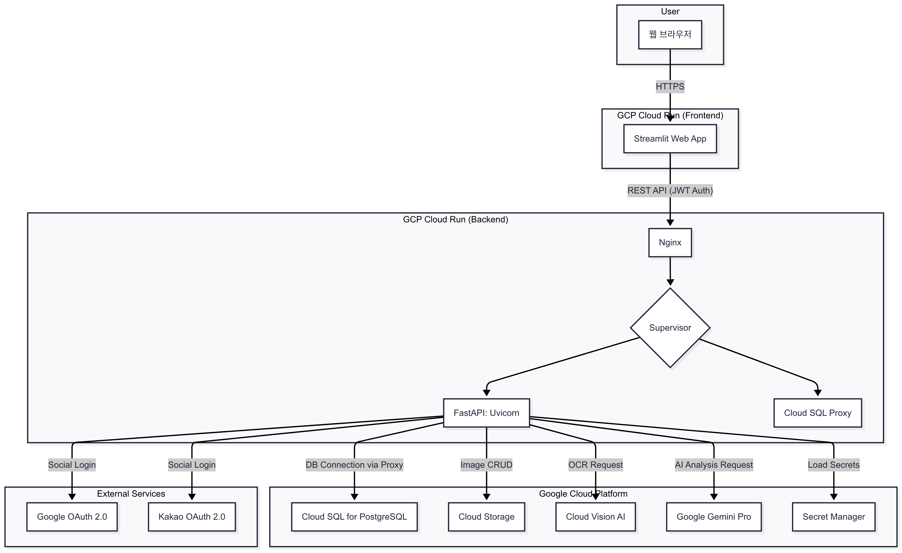
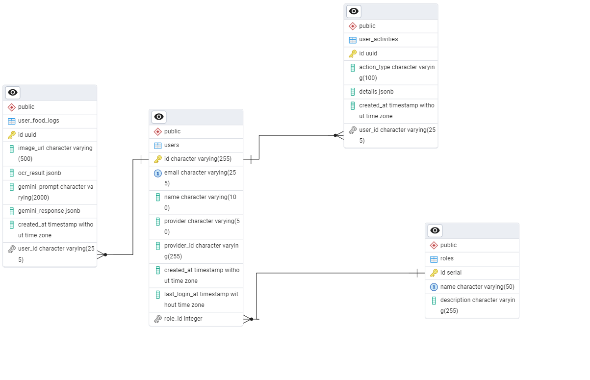
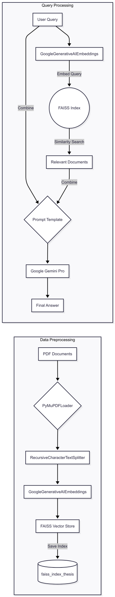

# 🤰 먹어도 돼? - 임산부를 위한 AI 성분 분석 가이드

**"이거, 임신 중에 먹어도 괜찮을까?"**  
세상 모든 예비 엄마들의 작은 걱정을 덜어주기 위해 시작된 AI 기반 웹 서비스입니다. 음식 성분표 이미지를 업로드하면, AI가 임신부에게 잠재적으로 유해할 수 있는 성분을 분석하고 신뢰할 수 있는 섭취 가이드를 제공합니다.

[](https://cloud.google.com/run)
[](https://fastapi.tiangolo.com/)
[](https://streamlit.io/)
[](https://ai.google/discover/gemini/)

---

## 프로젝트 소개

- 임신부를 위한 음식 성분 분석 및 섭취 가능 여부 안내 서비스
- 이미지 업로드 → OCR 성분 추출 → AI 분석 → 기록 관리
- 소셜 로그인(Google, Kakao) 지원
- 분석 기록 DB 저장 및 조회/삭제 기능
- GCP Cloud Run, Cloud SQL(PostgreSQL), Cloud Storage 연동

> ⏱️ 프로젝트 기간: **2025년 7월 25일 ~ 2025년 8월 18일**  
> 🛠️ 주요 언어: `FastAPI`, `Python(3.12.0)`, `PostgreSQL`
---

## ✨ 주요 기능

- **📸 모바일 최적화된 이미지 업로드**: 스마트폰 카메라로 직접 촬영하거나 갤러리에서 이미지를 손쉽게 업로드할 수 있습니다.
- **🔬 이미지 기반 성분표 OCR 추출**: Google Vision AI를 활용하여 이미지 속 텍스트를 정확하게 추출합니다.
- **🤖 AI(Gemini) 기반 섭취 가능 여부 분석**: RAG 기술을 접목하여 신뢰도 높은 섭취 가이드를 제공합니다.
- **👤 사용자별 분석 기록 관리**: 소셜 로그인(Google, Kakao)을 지원하며, 사용자별 분석 기록을 조회하고 삭제할 수 있습니다.
- **📊 분석 결과 다운로드**: 분석된 성분 목록을 TXT 또는 JSON 파일 형태로 다운로드할 수 있습니다.
- **⚙️ 유연한 실행 환경**: 로컬/클라우드 환경이 분리되어 있어 `run.bat` 스크립트로 손쉽게 테스트 환경을 전환할 수 있습니다.

---

## 🎥 프로젝트 데모

*(프로젝트 시연 영상.)*


| 로그인 | 이미지 업로드 | AI 분석 결과 |
| :---: | :---: | :---: |
| *(스크린샷 1)* | *(스크린샷 2)* | *(스크린샷 3)* |

---

## 🏛️ 시스템 아키텍처

MSA(Microservice Architecture) 사상을 적용하여 **Streamlit 프론트엔드**와 **FastAPI 백엔드**를 분리 설계했습니다. 이를 통해 각 서비스의 독립적인 개발 및 배포가 가능해졌고, 유지보수성을 향상시켰습니다. 모든 서비스는 Docker 컨테이너화되어 GCP Cloud Run을 통해 서버리스 환경에서 효율적으로 운영됩니다.


---

## 프로젝트 폴더 구조

```
can_i_eat/
├── app.py                # Streamlit 메인 앱
├── main.py               # FastAPI 백엔드
├── database/             # DB 모델 및 연결
├── models/               # Pydantic 스키마
├── services/             # OCR/AI 서비스
├── oauth/                # 소셜 로그인/연동 해제
├── utils/                # 유틸리티 함수/클래스
├── pages/                # Streamlit 페이지
├── requirements.txt      # Python 패키지 목록
├── Dockerfile            # 컨테이너 빌드 파일
├── nginx.conf            # Nginx 리버스 프록시 설정
├── supervisord.conf      # 프로세스 관리 설정
├── .env / env.yaml       # 환경 변수 파일
└── README.md             # 프로젝트 설명
```

---

## 📄 데이터베이스 ERD

사용자, 소셜 계정, 분석 기록을 중심으로 데이터 모델을 설계했으며, `SQLModel`을 사용하여 Python 클래스와 DB 스키마를 일관성 있게 관리합니다.


| 모델 | 설명 | 주요 필드 |
|-------|-------|-----------|
| users | 회원 정보 저장 | Id, email, name, provider, created_at, last_login_at |
| roles | 사용자 역할(권한) 구분 | id, name, description |
| UserFoodLog | 음식 성분 분석 기록 | Image_url, ocr_result, gemini_prompt, gemini_response, created_at |
| UserActivity | 사용자 활동 로그 | Id, action_type, details, created_at |

---

## ✨ 핵심 기능 및 구현 과정

### AI 답변 신뢰성 강화를 위한 RAG 아키텍처 구축

LLM의 가장 큰 약점인 **환각(Hallucination) 현상**을 최소화하고, 사실에 기반한 신뢰도 높은 답변을 제공하기 위해 **RAG(Retrieval-Augmented Generation)** 파이프라인을 직접 설계하고 구현했습니다.

#### RAG 파이프라인 흐름도


#### 구현 상세 (`services/rag.py`)

1.  **데이터 소스:** 임산부 영양 및 식품 안전 관련 논문, 의학 가이드라인 PDF 파일을 신뢰할 수 있는 원천 데이터로 사용했습니다.
2.  **문서 처리:** `PyMuPDFLoader`로 PDF 텍스트를 로드하고, `RecursiveCharacterTextSplitter`를 이용해 의미 단위의 청크(Chunk)로 분할하여 검색 정확도를 높였습니다.
3.  **임베딩 및 벡터 DB 구축:** `GoogleGenerativeAIEmbeddings` (model: `models/embedding-001`)를 사용해 각 텍스트 청크를 벡터로 변환했습니다. 변환된 벡터는 `FAISS`를 사용하여 인덱싱하고 로컬 파일로 저장하여, 애플리케이션 재시작 시 매번 벡터를 새로 생성하는 비용을 제거했습니다.
4.  **검색 및 생성 (Retrieval & Generation):**
    - 사용자 질문이 들어오면, 동일한 임베딩 모델로 질문을 벡터화합니다.
    - FAISS 인덱스 내에서 유사도가 가장 높은 K개의 문서 청크(Top-K)를 검색합니다.
    - 검색된 문서(Context)와 사용자 질문(Question)을 프롬프트 템플릿에 결합하여 Gemini Pro 모델에 전달합니다.
    - 최종적으로, Gemini 모델은 주어진 컨텍스트를 바탕으로 질문에 대한 답변을 생성합니다. 이 모든 과정은 `LangChain`의 `RetrievalQA` 체인을 활용하여 효율적으로 구현했습니다.

---

## 🛠️ 기술 스택

| 구분 | 기술 / 서비스 | 목적 |
| :--- | :--- | :--- |
| **Backend** | `FastAPI`, `Python 3.12`, `Uvicorn` | REST API 서버 구축, 비동기 처리 |
| **Frontend** | `Streamlit` | 신속한 프로토타이핑 및 데이터 시각화 UI |
| **Database** | `PostgreSQL (GCP Cloud SQL)`, `SQLModel` | 데이터 영속성, ORM을 통한 생산성 향상 |
| **AI & RAG** | `Google Gemini Pro`, `LangChain`, `FAISS` | AI 분석, 환각 현상 억제, 답변 신뢰도 향상 |
| **OCR** | `Google Cloud Vision AI` | 이미지 내 텍스트 추출 |
| **Infra** | `GCP Cloud Run`, `Docker`, `Nginx`, `Supervisor` | 서버리스 배포, 컨테이너화, 프로세스 관리 |
| **Storage** | `GCP Cloud Storage` | 이미지 파일 등 정적 자원 저장 |
| **Auth** | `OAuth 2.0 (Google, Kakao)`, `JWT` | 소셜 로그인, Stateless API 인증/인가 |

---

## 사용법

1. 소셜 로그인(Google/Kakao)으로 접속
2. 이미지 업로드 → 성분 추출 → AI 분석
3. 분석 결과 다운로드/기록 관리
4. 관리자 페이지에서 전체 기록 조회/삭제

---

## 🤯 트러블슈팅 및 해결 과정

### 1. Cloud Run 환경에서의 DB 연결 불안정 문제
- **문제:** 로컬에서는 잘 되던 DB 연결이 Cloud Run 배포 환경에서는 간헐적으로 실패하거나 Timeout이 발생. Public IP를 이용한 직접 연결은 불안정하고 보안에 취약했습니다.
- **해결:** **Cloud SQL Auth Proxy**를 사이드카(Sidecar) 패턴으로 배포하는 방식으로 변경했습니다. `supervisord.conf`에 Proxy 실행 프로세스를 추가하고, FastAPI는 Unix 소켓을 통해 Proxy와 통신하도록 수정했습니다. 이를 통해 Public IP 노출 없이 IAM 기반의 안전하고 안정적인 DB 커넥션을 확보했습니다.

### 2. 대용량 PDF 처리 시 메모리 초과
- **문제:** RAG 시스템의 기반 데이터를 추가하기 위해 수백 페이지의 PDF를 처리하는 과정에서 Cloud Run 인스턴스의 메모리 한계를 초과하여 서버가 다운되었습니다.
- **해결:** `services/rag.py`에 **점진적 처리(Incremental Processing)** 로직을 추가했습니다. 문서 청크의 개수가 임계값을 초과하면, 전체를 한 번에 처리하는 대신 작은 배치(Batch) 단위로 나누어 순차적으로 벡터화하고 인덱스에 추가하도록 로직을 수정했습니다. 각 배치 처리 후 `gc.collect()`를 명시적으로 호출하여 메모리 사용량을 안정적으로 관리했습니다.

### 3. 로컬/클라우드 환경 변수 관리의 복잡성
- **문제:** 로컬 테스트와 클라우드 배포 시 DB 접속 정보, API URL 등 다른 환경 변수를 사용해야 했으나, `.env` 파일 하나로 관리하여 수동 변경이 잦고 실수가 발생했습니다. 또한, 여러 파이썬 파일에서 `load_dotenv()`를 중복 호출하여 설정이 덮어쓰이는 문제가 발생했습니다.
- **해결:** **중앙 집중식 환경 로더(`utils/env_loader.py`)를 구현**했습니다. `APP_ENV`라는 환경 변수 값('local' 또는 'cloud')에 따라 `.env.local` 또는 `.env.cloud` 파일을 선택적으로 로드하도록 설계했습니다. 각 모듈에 흩어져 있던 `load_dotenv()` 호출을 모두 제거하고, 앱 시작점(`main.py`, `app.py`)에서만 로더를 호출하도록 구조를 변경하여 환경 변수 관리의 일관성과 안정성을 확보했습니다.

### 4. 정적 파일(이미지) 경로 문제로 인한 404 오류
- **문제:** 사용자가 업로드한 이미지가 DB에는 정상 저장되었으나, 웹 페이지에서 이미지를 불러올 때 404 Not Found 오류가 발생했습니다. FastAPI의 정적 파일 마운트 경로(`app.mount`)와 실제 DB에 저장된 이미지 URL 경로가 일치하지 않았기 때문입니다.
- **해결:** `main.py`의 `app.mount("/static", ...)` 설정을 `app.mount("/uploads", ...)`로 변경하여, 실제 파일이 저장되는 디렉토리 이름과 URL 경로를 직관적으로 일치시켰습니다. 이를 통해 프론트엔드에서 `API_URL/uploads/images/...` 형태로 요청했을 때 FastAPI가 올바른 파일을 찾아 제공할 수 있도록 수정했습니다.

---

## 📈 프로젝트 회고 (KPT)

### Keep (지속할 점)
- **명확한 역할 분리:** FastAPI(백엔드)와 Streamlit(프론트엔드)의 조합은 빠른 개발 속도와 명확한 책임 분리라는 두 마리 토끼를 모두 잡을 수 있었습니다.
- **RAG를 통한 신뢰성 확보:** 단순히 LLM을 호출하는 것을 넘어, RAG 아키텍처를 직접 구축하며 LLM의 약점을 보완하고 서비스의 핵심 가치인 '신뢰성'을 높일 수 있었던 경험은 큰 자산이 되었습니다.
- **서버리스 아키텍처:** GCP의 관리형 서비스(Cloud Run, Cloud SQL 등)를 활용하여 인프라 관리 부담을 최소화하고 비즈니스 로직 개발에 집중할 수 있었습니다.

### Problem (아쉬운 점)
- **부족한 테스트 코드:** 개발 속도를 우선시하다 보니 자동화된 테스트 코드 작성이 미흡했습니다. 이로 인해 새로운 기능 추가 시 회귀 테스트에 많은 수동 리소스가 소요되었습니다.
- **수동적인 배포 프로세스:** 현재는 로컬에서 수동으로 Docker 이미지를 빌드하고 Cloud Run에 배포하고 있어, 과정이 번거롭고 휴먼 에러의 가능성이 존재합니다.

### Try (향후 개선 계획)
- **테스트 자동화:** `pytest`를 도입하여 핵심 비즈니스 로직과 API 엔드포인트에 대한 단위/통합 테스트 코드를 작성하고, 코드 커버리지를 80% 이상으로 관리하고 싶습니다.
- **CI/CD 파이프라인 구축:** GitHub Actions나 Cloud Build를 사용하여, `main` 브랜치에 코드가 푸시되면 자동으로 테스트, 빌드, 배포가 이루어지도록 파이프라인을 구축하여 개발 생산성을 높이고자 합니다.
- **성능 최적화:** 자주 묻는 질문이나 분석 빈도가 높은 성분에 대해서는 AI 분석 결과를 Redis 같은 인메모리 DB에 캐싱(Caching)하여, 반복적인 AI 호출을 줄이고 응답 속도를 개선하는 로직을 추가하고 싶습니다.

---

## 🚀 시작하기 (Getting Started)

### 1. 사전 요구사항
- [Git](https://git-scm.com/)
- [Python](https://www.python.org/) 3.12+

### 2. 로컬 환경 설정 및 실행

**1. 프로젝트 클론**
```bash
git clone https://github.com/jjjjunn/can_i_eat_st.git
cd can_i_eat_st
```

**2. 가상환경 생성 및 활성화**
```bash
# Python 가상환경 생성
python -m venv venv

# Windows
venv\Scripts\activate

# macOS / Linux
source venv/bin/activate
```

**3. 필수 패키지 설치**
```bash
pip install --upgrade pip
pip install -r requirements.txt
```

**4. 환경 변수 설정**

이 프로젝트는 실행 환경(로컬/클라우드)에 따라 다른 설정 파일을 사용합니다.

- `.env.example` 파일을 복사하여 `.env.local`과 `.env.cloud` 두 개의 파일을 생성합니다.
- **`.env.local`**: 로컬 개발 환경에서 사용될 설정 파일입니다. `DATABASE_URL`, `GOOGLE_REDIRECT_URI` 등을 `localhost` 또는 `127.0.0.1` 기준으로 설정하세요.
- **`.env.cloud`**: 클라우드 배포 환경에서 사용될 설정 파일입니다. 실제 서비스 URL 기준으로 설정하세요.

```bash
# .env.local, .env.cloud 파일 생성 (Windows CMD)
copy .env.example .env.local
copy .env.example .env.cloud
```
> ⚠️ **중요**: 생성된 `.env.local`과 `.env.cloud` 파일을 열어, 각 환경에 맞는 실제 값들 (API 키, DB 정보 등)을 반드시 입력해야 합니다.

**5. 애플리케이션 실행**

프로젝트 루트 디렉토리의 `run.bat` 스크립트를 사용하여 FastAPI 백엔드와 Streamlit 프론트엔드를 동시에 실행할 수 있습니다.

- **로컬 모드로 실행 (기본):**
  ```cmd
  run.bat
  ```
  > 이 명령어는 `APP_ENV`를 `local`로 간주하고 `.env.local` 파일을 읽어 서버를 실행합니다.

- **클라우드 모드로 실행 (테스트용):**
  ```cmd
  run.bat cloud
  ```
  > 이 명령어는 `APP_ENV`를 `cloud`로 설정하고 `.env.cloud` 파일을 읽어 서버를 실행합니다.

실행 후, 웹 브라우저에서 `http://localhost:8501` 주소로 접속하여 서비스를 확인할 수 있습니다.

---

## 📜 라이선스 (License)

이 프로젝트는 [MIT License](LICENSE) 를 따릅니다.
